# Steel Defect Detection - Stage 1

## Table of Contents
- [1. Introduction](#1-introduction)
- [2. Project Overview](#2-project-overview)
- [3. Environment Setup](#3-environment-setup)
    - [3.1. Repository Setup](#31-repository-setup)
    - [3.2. Dataset Setup](#32-dataset-setup)
    - [3.3. GPU Support](#33-gpu-support)
    - [3.4. Project Directory Structure](#34-project-directory-structure)
- [4. EDA](#4-eda)
    - [4.1. Data Overview](#41-data-overview)
    - [4.2. Visual Example of Defects](#42-visual-example-of-defects)
    - [4.3. Defect Class Distribution](#43-defect-class-distribution)
    - [4.4. Image with Multiple Defect Types](#44-image-with-multiple-defect-types)
    - [4.5. Defect Area](#45-defect-area)
    - [4.6. Color Distribution](#46-color-distribution)
    - [4.7. Defect Center Location](#47-defect-center-location)
- [5. Model Training, Evaluation and Parameter Tuning](#5-model-training-evaluation-and-parameter-tuning)
    - [5.1. Mobilenet V2](#51-mobilenet-v2)
    - [5.2 Final Model](#52-final-model)
- [6. Exporting Notebook to Script](#6-exporting-notebook-to-script)
- [7. Deployment API and Dockerization](#7-deployment-api-and-dockerization)
    - [7.1. FastAPI](#71-fastapi)
    - [7.2. Docker](#72-docker)
    - [7.3. AWS Serverless](#73-aws-serverless)
- [8. Deploy on Google Cloud (Cloud Run)](#8-deploy-on-google-cloud-cloud-run)
    - [8.1. Install gcloud on Ubuntu](#81-install-gcloud-on-ubuntu)
    - [8.2. Install gcloud on Windows](#82-install-gcloud-on-windows)
    - [8.3. Initialize and authorize the gcloud CLI](#83-initialize-and-authorize-the-gcloud-cli)
    - [8.4. Deploy to Cloud Run](#84-deploy-to-cloud-run)
- [9. Web UI with Streamlit](#9-web-ui-with-streamlit)
- [10. Future Work](#10-future-work)

---

## 1. Introduction

In manufacturing, product quality control is an important part of the production process. Before products are shipped to customers, inspection is required to make sure the quality and specifications meet customer requirements. In steel manufacturing, defects on the steel surface can reduce product quality and cause customer complaints.

To improve the inspection process, this project uses a camera to capture images of steel surfaces and applies machine learning to analyze the images. The model predicts whether the steel has a defect and provides a probability score. This helps operators more easily identify and mark defective steel, making the inspection process faster and more consistent.

System Overview

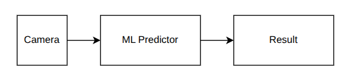

The system consists of three main components. First, a camera captures images of the steel surface on the production line. These images are then sent to the machine learning predictor, which analyzes the images to detect defects. Finally, the system produces a result indicating whether the steel is defective, along with a prediction confidence. This result helps operators make quick decisions during the inspection process.


## 2. Project Overview

This project is designed as a two-stage pipeline for steel surface defect inspection in an industrial production line.

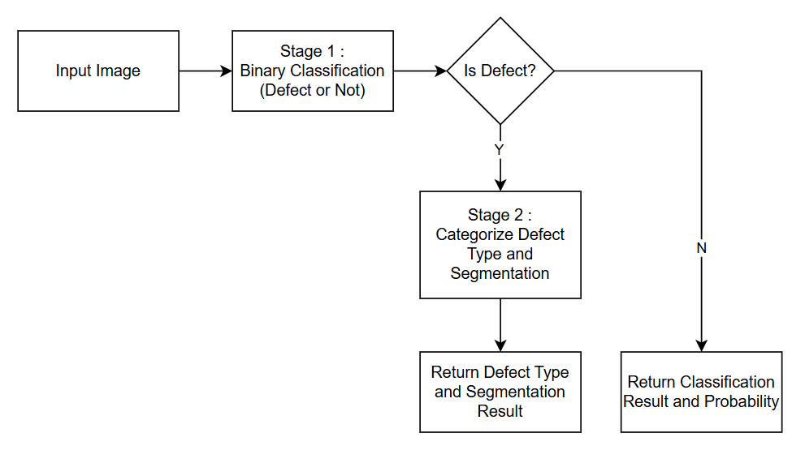

Stage 1 focuses on defect detection using binary image classification, where the model determines whether an input steel surface image contains a defect or not. This stage acts as a fast screening mechanism to filter defective samples early in the pipeline. 

Stage 2 (planned future work) extends the system with defect type classification and defect localization using segmentation, enabling precise identification of defect regions for deeper analysis and quality control.

In the current project, the scope is limited to Stage 1 only due to time constraints of "Project Capstone 1".
The work includes data exploration, model training, parameter tuning, evaluation, threshold tuning, model selection and deployment. Stage 2 is not implemented or evaluated in this project.


## 3. Environment Setup

This project uses uv for Python dependency and virtual environment management.
uv automatically creates an isolated environment and installs all required packages defined in pyproject.toml.

### 3.1. Repository Setup
1. Clone the repository:
   ```
   git clone https://github.com/mlpub/steel-defect-detection-s1
   cd steel-defect-detection-s1
   ```
2. Verify that uv is installed:
    ```
    uv --version
    ```
    If uv is not available, install it using:
    ```
    pip install uv
    ```

3. Synchronize dependencies
    ```
    uv sync --extra dev
    ```
    This command creates a virtual environment and installs all required dependencies automatically.

    The `--extra dev` option installs the additional dependencies defined under the `dev` extra, which are required for local development (such as training and experimentation libraries).
    Without this option, uv sync installs only the base dependencies, which are intended for the Docker / production environment.

    This extras mechanism in uv makes it easy to manage environment-specific dependencies (e.g., development vs. production) using a single pyproject.toml file.

    Example pyproject.toml:
    ```
    [project]
    name = "steel-defect"
    version = "0.1.0"
    description = "Add your description here"
    readme = "README.md"
    requires-python = ">=3.12"

    # Base dependencies (used by Docker / Cloud Run)
    dependencies = [
        "fastapi",
        "uvicorn",
        "numpy",
        "pydantic",
        "pillow",
        "onnx",
        "onnxruntime",
    ]

    [project.optional-dependencies]

    # Local development / training
    dev = [
        "pandas",
        "matplotlib",
        "scikit-learn",
        "requests",
        "opencv-python-headless",
        "torch",
        "torchvision",
        "onnxscript",
        "onnxruntime-tools",
    ]

    # docker
    docker = []
    ```


### 3.2. Dataset Setup
The dataset consists of CSV annotation files and steel surface images.
* Due to the large dataset size (over 1 GB), this repository includes only 25 sample images to illustrate the directory structure.
* The full dataset can be downloaded from the Kaggle [Severstal Steel Defect Detection](https://www.kaggle.com/competitions/severstal-steel-defect-detection).

After downloading:
1. Extract the dataset.
2. Copy all training images into the following directory:
   ```
   data/train_images
   ```
3. The CSV files already included in this repository (don't replace it).


### 3.3. GPU Support
To accelerate model training, using a CUDA-enabled GPU is recommended.
All experiments in this project were conducted with GPU acceleration enabled (using RTX 4060ti 16GB).

### 3.4. Project Directory Structure
```
project_root/
├── data/
│   ├── train_images/
│   └── *.csv
├── images/
├── notebooks/
├── gcp/
└── src/
```
* project_root/: contains uv configuration, Dockerfile, and documentation (Markdown files).
* data/: Contains all training data, including images and CSV files.
* train_images/: Stores all training images.
* images/: Images used in documentation and reports.
* notebooks/: Jupyter notebooks for exploration and experiments.
* gcp/: Files to deploy into Cloud Run. 
* src/: Python source code for training, evaluation, and utilities.


## 4. EDA

Exploratory Data Analysis was conducted in the following notebooks:

* [EDA 01 – Dataset overview and label distribution](https://github.com/mlpub/steel-defect-detection-s1/blob/main/notebooks/steel-defect-detection-eda-01.ipynb)
* [EDA 02 – Image analysis](https://github.com/mlpub/steel-defect-detection-s1/blob/main/notebooks/steel-defect-detection-eda-02.ipynb)
* [EDA 03 – Defect Center Location](https://github.com/mlpub/steel-defect-detection-s1/blob/main/notebooks/steel-defect-detection-eda-03.ipynb)


### 4.1. Data Overview

The dataset used in this project is obtained from the Kaggle [Severstal Steel Defect Detection](https://www.kaggle.com/competitions/severstal-steel-defect-detection).

The dataset consists of a single CSV file (train.csv) and a collection of steel surface images stored in the train_images directory.
The total number of images is 12,568, and all images have the same resolution of 1600 × 256 pixels (W × H).

The train.csv file contains annotations describing defect locations and defect class labels. Defect regions are encoded using run-length encoding (RLE). The dataset includes four defect classes:
- Class 1
- Class 2
- Class 3
- Class 4

#### Run-Length Encoding (RLE)
In RLE format, each image mask is converted into a one-dimensional array.
Given an image resolution of 1600 × 256, the mask is flattened into a vector of size 409,600 × 1.
An example RLE entry is ```29102 12```, which indicates that a defect starts at pixel index 29,102 and spans 12 consecutive pixels, covering indices 29,102 to 29,113.

#### Binary label construction
As described in "Project Overview" section, this project focuses on binary classification, where steel images are classified as defect or non-defect. 

The original train.csv file contains annotations only for images with defects. To construct binary labels:
* Images with at least one RLE annotation were labeled as defect
* Images without any annotations were labeled as non-defect

The final dataset is stored as train_with_bboxes.csv, which includes a binary defect label.

Distribution of defect and non-defect images:
| Category    | Count | Percentage |
|-------------|-------|------------|
| Defect      | 6,666 | 53.04%     |
| Non-defect  | 5,902 | 46.96%     |

 
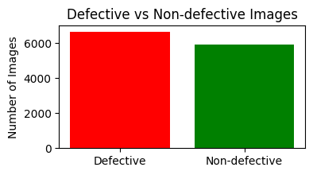

The dataset is relatively balanced, with more defect images.


### 4.2. Visual Example of Defects

Representative examples of each class are shown below.

#### No-Defect

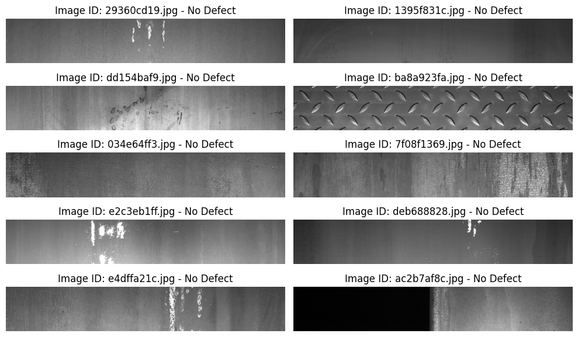

#### Defect Class 1

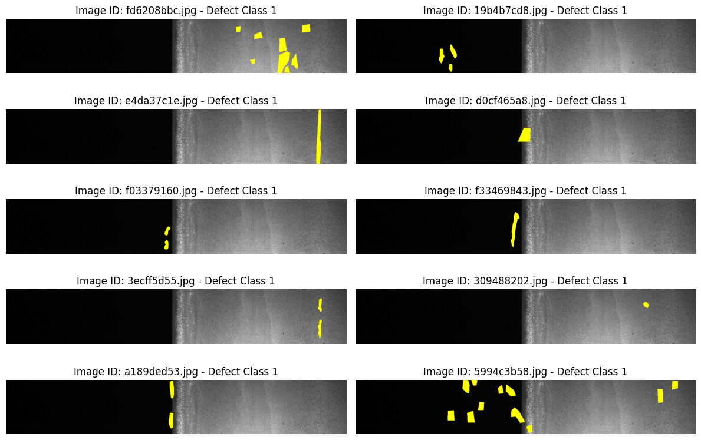

#### Defect Class 2

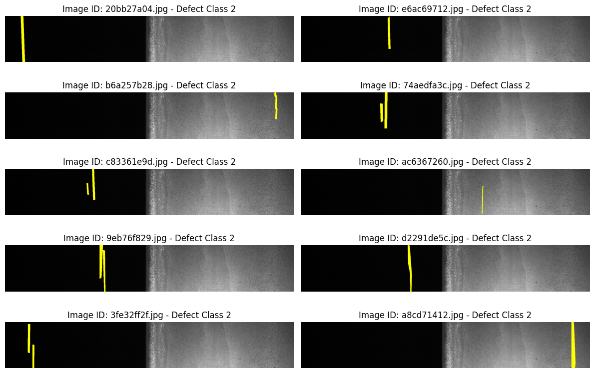

#### Defect Class 3

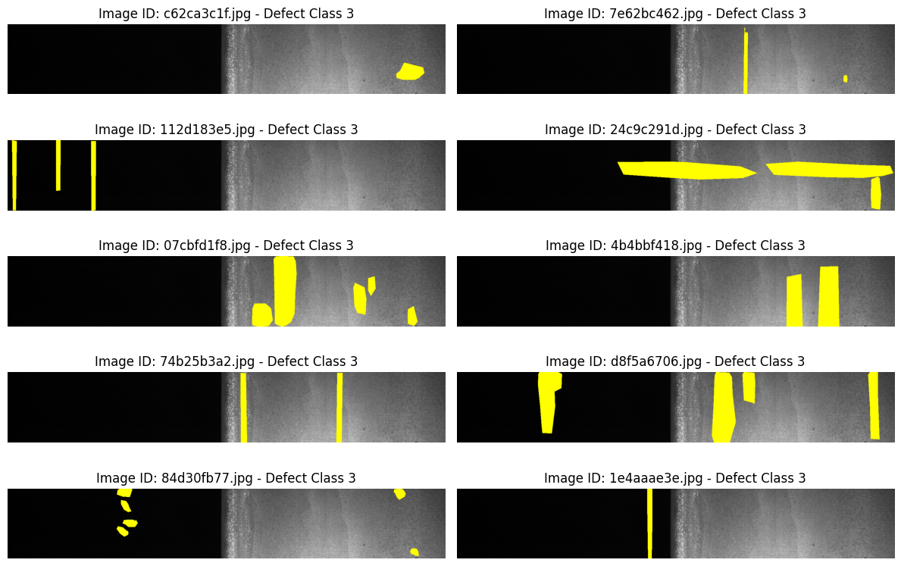

#### Defect Class 4

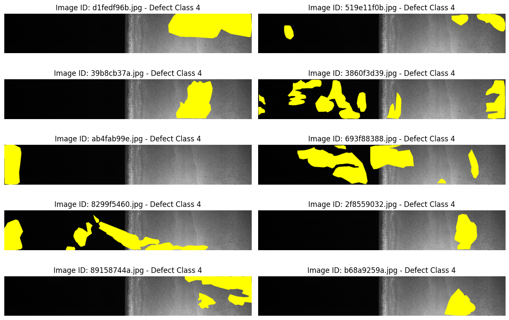


### 4.3. Defect Class Distribution

The distribution of defect classes is highly imbalanced.
Class 3 dominates the dataset, around 72.59% of all defect annotations, followed by Classes 1 and 4. Class 2 is the rarest.

| Class | Proportion (%) |
|-------|---------------|
| 3     | 72.59         |
| 1     | 12.64         |
| 4     | 11.29         |
| 2     | 3.48          |

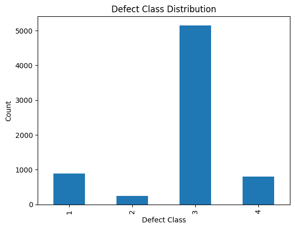

The defect Class distribution is imbalanced. This imbalance has implications for model training and evaluation, particularly for recall on minority classes. 
But in this project focused on binary classification (defect/non-defect), the imbalance among defect classes is ignored.


### 4.4. Image with Multiple Defect Types

Among the 6,666 images containing defects, most contain only a single defect type.
* Images with single defect: 6239
* Image with 2 defect types: 425
* Images with 3 defect types: 2 

The two images containing three defect types are:
* ef24da2ba.jpg (Classes 1,2,3).
* db4867ee8.jpg (Classes 1,2,3).

Overall:
* 93.59% of defect images contain a single defect.
* 6.41% contain multiple defect types.


Class distribution within multi-defect images:
| ClassId | Count | Percentage |
|---------|-------|------------|
| 1       | 128   | 14.95%     |
| 2       | 52    | 6.07%      |
| 3       | 391   | 45.68%     |
| 4       | 285   | 33.29%     |

Excluding the two images with three defects, the following defect pairs were observed:
| Defect Pair | Count | Percentage |
|-------------|-------|------------|
| (3, 4)      | 284   | 66.82%     |
| (1, 3)      | 91    | 21.41%     |
| (1, 2)      | 35    | 8.24%      |
| (2, 3)      | 14    | 3.29%      |
| (2, 4)      | 1     | 0.24%      |

The pair (Class 3, Class 4) is the most frequent, around two-thirds of multi-defect cases.

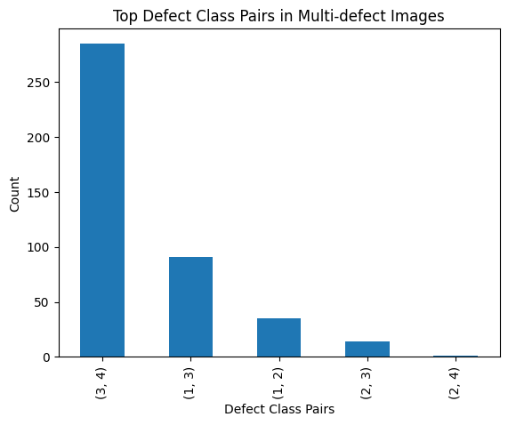


### 4.5. Defect Area

Defect area was calculated by counting the number of pixels in each defect mask.

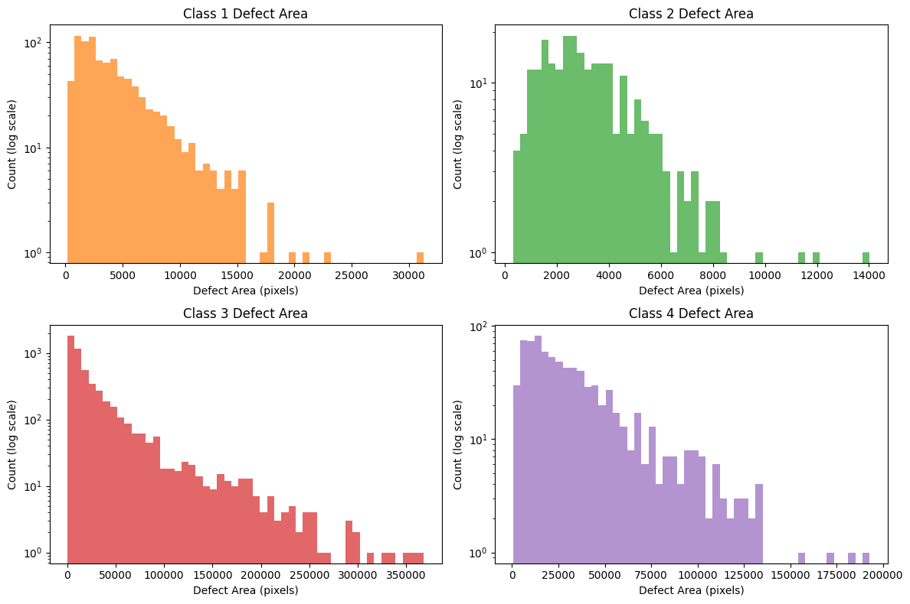

Classes 3 and 4 have significantly larger defect areas, while Classes 1 and 2 generally smaller localized defects.

| ClassId | Count  | Mean      | Std        | Min   | 25%    | 50%    | 75%    | Max      |
|---------|--------|-----------|------------|-------|--------|--------|--------|----------|
| 1       | 897    | 4361.35   | 3591.05    | 163   | 1762   | 3326   | 5795   | 31303    |
| 2       | 247    | 3378.43   | 2049.38    | 316   | 1947.5 | 2944   | 4337.5 | 14023    |
| 3       | 5150   | 25496.49  | 37945.33   | 115   | 5054.25| 11953.5| 29029.5| 368240   |
| 4       | 801    | 34373.99  | 29590.27   | 491   | 13114  | 25357  | 45221  | 192780   |

All defect area distributions are right-skewed, indicating a small number of very large defects.


### 4.6. Color Distribution

All images are dominated by black and gray tones, reflecting the uniform texture and lighting conditions of steel surfaces.


This limited color variation suggests that texture and structural patterns, rather than color.


### 4.7. Defect Center Location

For each segmented defect, the bounding box coordinates (x1,y1,x2,y2) are computed.
From these values, the center of the bounding box is calculated as:
```
xc = x1 + (x2 - x1) / 2
yc = y1 + (y2 - y1) / 2
```
The distributions of x-center (xc) and y-center (yc) are then plotted for each ClassId to analyze the typical spatial locations of defects along the steel strip.

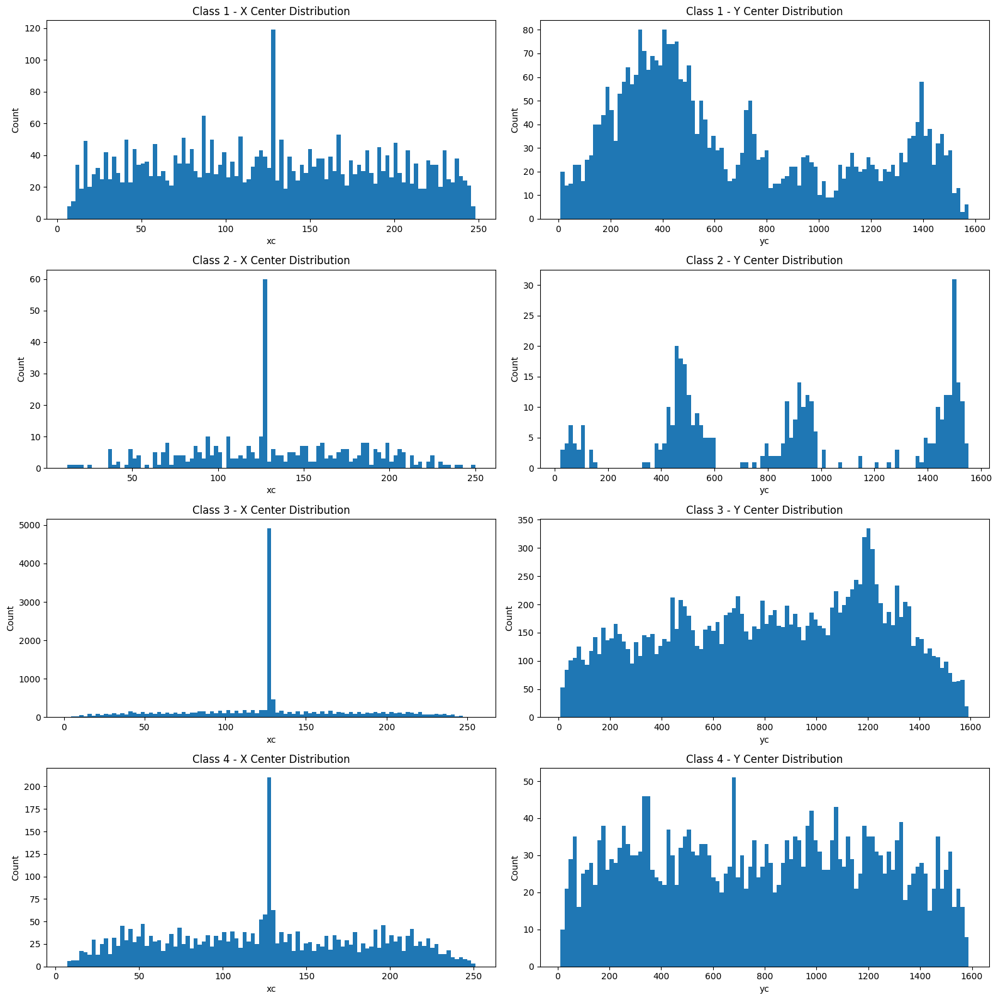


Observations by Class:
* Class 1
    The x-center is strongly concentrated around the middle of the image (≈ 125), with remaining values spread across the width.
    The y-center shows clusters, primarily around: 
    - 300–500
    - ~750
    - ~1400
    Most defects appear below y = 600, indicating most defect is in area between 0-600.

* Class 2
    The x-center distribution is similar to Class 1, centered around ≈ 125.
    The y-center is clearly separete, with clusters around:
    - 0–200
    - 400–500
    - 800–1000
    - 1400–1600
    The strongest concentration is near y ≈ 1550, suggesting defects often occur near the right side of the strip.

* Class 3
    The x-center again peaks around the image center.
    The y-center is broadly distributed across the entire height (0–1600).

* Class 4
    Similar to Class 3, the x-center is centered around ≈ 125.
    The y-center shows a wide and fairly uniform distribution over the full image height.

Class 1 defects tend to occur in the left regions of the strip.
Class 2 defects show distinct grouping, like multiple defect formation zones.
Class 3 and Class 4 have similar spatial distributions, with defects occurring across the strip.


## 5. Model Training, Evaluation and Parameter Tuning

This section focuses on the practical process of training, evaluating, and tuning models for binary steel surface defect classification. Two CNN architectures are used: MobileNet V2, selected for its fast inference and low computational cost.

Both models are trained using the same dataset and evaluation. Model performance is evaluated using several metrics, including Accuracy, Precision, Recall, F1 Score, and ROC-AUC. Multiple experiments are conducted by adjusting key parameters—such as learning rate, number of trainable layers, input image size, dropout, optimizer, and data augmentation, to analyze their impact on model performance.

To enable faster experimentation, a subset of the full training data is used instead of the complete dataset. The original dataset is first split into training, validation, and test sets with a ratio of 70% / 15% / 15%, where the validation and test sets are kept fixed and not used during doing experiment.

From the 70% training portion, a smaller subset is created for rapid experimentation. This subset consists of 3,500 images for training and 1,500 images for validation. These smaller datasets are used for model comparison and parameter tuning, allowing faster iteration while preserving the integrity of the original validation and test sets.

Images were resized to a square input resolution (256×256 and 384×384), which may distort the original aspect ratio but simplifies batching and convolutional neural network (CNN) input requirements.
Due to the highly imbalanced original image dimensions (1600×256), this resizing approach may cause small defects to become less prominent or partially lost, particularly for defects with small spatial extent.


### 5.1. Mobilenet V2

The original MobileNet V2 architecture is designed for 1,000-class ImageNet classification. Since this project addresses a binary steel surface defect classification task, the final fully connected (FC) layer is replaced with a single-output layer. A sigmoid activation is implicitly handled by using BCEWithLogitsLoss, allowing the model to output raw logits during training.


#### E1-1: Baseline Experiment
This experiment serves as the baseline configuration for MobileNet V2, providing a reference point for subsequent tuning experiments.
Parameters:
    - Dataset train 3500, val 1500
    - Batch size: 20
    - Image size: 256x256
    - Epochs: 20
    - Loss function: nn.BCEWithLogitsLoss()
    - Optimizer: SGD
    - Learning rate: 1.0e-4

Model Architecture:
    - Feature extraction: self.base_model(x)
    - Flatten layer: self.flatten(x)
    - Classification layer: self.fc(x)

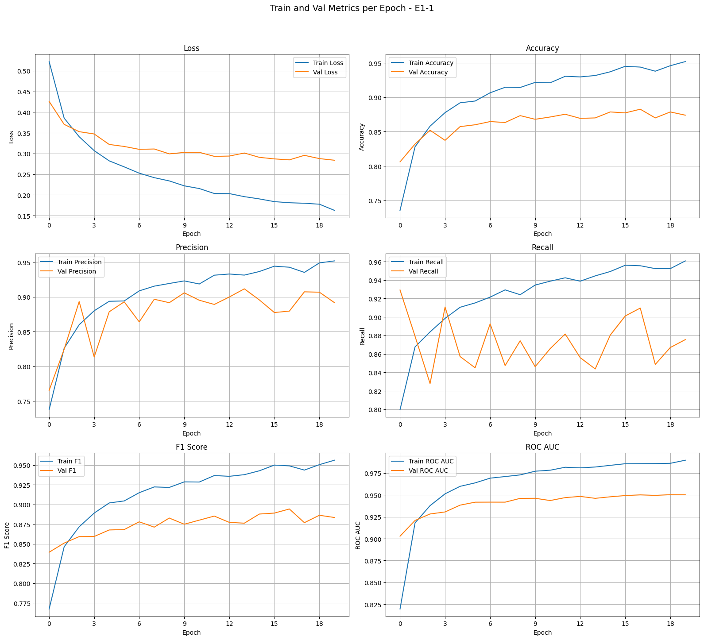

Notebook link: [Experiment E1-1](https://github.com/mlpub/steel-defect-detection-s1/blob/main/notebooks/stage1-binary-classification-e1-1.ipynb)


#### E1-6: Unfreeze 3 layer, add globalavg, Dropout, and Relu
This experiment introduces partial fine-tuning by unfreezing the last three layers of the backbone and adds Global Average Pooling, Dropout, and ReLU to improve generalization.

Parameters
- Dataset train 3500, val 1500
- Batch size: 20
- Image size: 256x256
- Epochs: 15
- Loss function: nn.BCEWithLogitsLoss()
- Optimizer: Adam
- Learning rate: 1.0e-4

Model Architecture:
- Feature extraction: self.base_model(x)
- Unfreeze 3 layers
- Global Average: self.globalavg(x) # (2,2)
- Flatten layer: self.flatten(x)
- Classification layer: self.fc(x)  #(5120,1024)->Dropout(0.3)->Relu->(1024,1)

Notebook link: [Experiment E1-6](https://github.com/mlpub/steel-defect-detection-s1/blob/main/notebooks/stage1-binary-classification-e1-6.ipynb)


#### E1-9: Increased Input Resolution and Data Augmentation
This experiment increases the input image resolution and applies data augmentation, while retaining partial fine-tuning and the Adam optimizer.

Parameters:
- dataset train 3500, val 1500
- Batch size: 20
- Image size: 384x384
- Epochs: 30
- Loss function: nn.BCEWithLogitsLoss()
- Optimizer: Adam
- Learning rate: 1e-5
- Augmentation: horizontal flip and vertical flip

Model Architecture:
- Feature extraction: self.base_model(x)
- Unfreeze 3 layers
- Global Average: self.globalavg(x) # (2,2)
- Flatten layer: self.flatten(x)
- Classification layer self.fc(x) # (5120,512)->Dropout(0.5)->Relu->(512,1)

Notebook link: [Experiment E1-9](https://github.com/mlpub/steel-defect-detection-s1/blob/main/notebooks/stage1-binary-classification-e1-9.ipynb)


#### E1-15: Final MobileNet V2 Configuration
This experiment further increases model capacity by unfreezing four layers of the backbone while retaining the same input resolution and regularization strategy.

Parameters:
- dataset train 3500, val 1500
- Batch size: 20
- Image size: 384x384
- Epochs: 30
- Loss function: nn.BCEWithLogitsLoss()
- Optimizer: Adam
- Learning rate: 1e-5
- Augmentation

Model Architecture:
- Feature extraction: self.base_model(x)
- Unfreeze 4 layers
- Global Average: self.globalavg(x) # (2,2)
- Flatten layer: self.flatten(x)
- Classification layer self.fc(x) # (5120,512)->Dropout(0.5)->Relu->(512,1)


#### Experiment Result Summary

Validation Metrics:
| Experiment | val_loss  | val_acc  | val_precision | val_recall | val_f1   | val_rocauc |
|------------|-----------|----------|---------------|------------|----------|------------|
| E1-1       | 0.283817  | 0.874000 | 0.891791      | 0.875458   | 0.883549 | 0.950253   |
| E1-6       | 0.422551  | 0.908000 | 0.917791      | 0.913309   | 0.915545 | 0.968849   |
| E1-9       | 0.211218  | 0.920000 | 0.938519      | 0.913309   | 0.925743 | 0.974137   |
| E1-15      | 0.199962  | 0.921333 | 0.937578      | 0.916972   | 0.927160 | 0.978280   |


Confusion Matrix (Validation):
| Experiment | TN     | FP     | FN     | TP     |
|------------|--------|--------|--------|--------|
| E1-1       | 594    | 87     | 102    | 717    |
| E1-6       | 614    | 67     | 71     | 748    |
| E1-9       | 632    | 49     | 71     | 748    |
| E1-15      | 631    | 50     | 68     | 751    |

**Model Selection**
Based on the validation results, E1-15 achieves the best overall performance, with the highest F1 score and ROC-AUC while maintaining strong recall, which is critical for defect detection tasks. Therefore, E1-15 is selected as the final MobileNet V2 configuration.

Notebook link: [Experiment E1-15](https://github.com/mlpub/steel-defect-detection-s1/blob/main/notebooks/stage1-binary-classification-e1-15.ipynb)


### 5.2 Final Model 

#### Retraining E1-15 with Full Training and Validation Dataset

After selecting E1-15 as the best MobileNet V2 configuration based on experiments with the reduced dataset, the model is retrained using a larger portion of the available data to improve generalization performance.

The retraining process uses the full training and validation splits, consisting of 8,000 training images and 2,000 validation images, while keeping the model architecture and most hyperparameters unchanged.

Parameters:
- Dataset train full 8000 images, val 2000 images
- Batch size: 20
- Image size: 384x384
- Epochs: 20
- Loss function: nn.BCEWithLogitsLoss()
- Optimizer: Adam
- Learning rate: 1e-5
- Augmentation

Model Architecture:
- Feature extraction: self.base_model(x)
- Unfreeze 4 layers
- Global Average: self.globalavg(x) # (2,2)
- Flatten layer: self.flatten(x)
- Classification layer self.fc(x) # (5120,512)->Relu->Dropout(0.5)->(512,1)


Validation Metrics:
| Experiment | val_loss  | val_acc  | val_precision | val_recall | val_f1   | val_rocauc |
|------------|-----------|----------|---------------|------------|----------|------------|
| E1-15b     | 0.139145  | 0.950256 | 0.950652      | 0.958685   | 0.954652 | 0.988015   |

Confusion Matrix (Validation):
| Experiment | TN  | FP | FN | TP  |
|------------|-----|----|----|-----|
| E1-15b     | 832 | 53 | 44 | 1021 |

Compared to the earlier experiments conducted on a reduced dataset, retraining the model with a larger training set results in consistent improvements across all validation metrics. Validation recall and F1 score increase substantially, indicating better defect detection capability and improved generalization.

These results confirm that using more training data significantly enhances model performance, and therefore E1-15b is selected as the final MobileNet V2 model for subsequent evaluation and comparison.

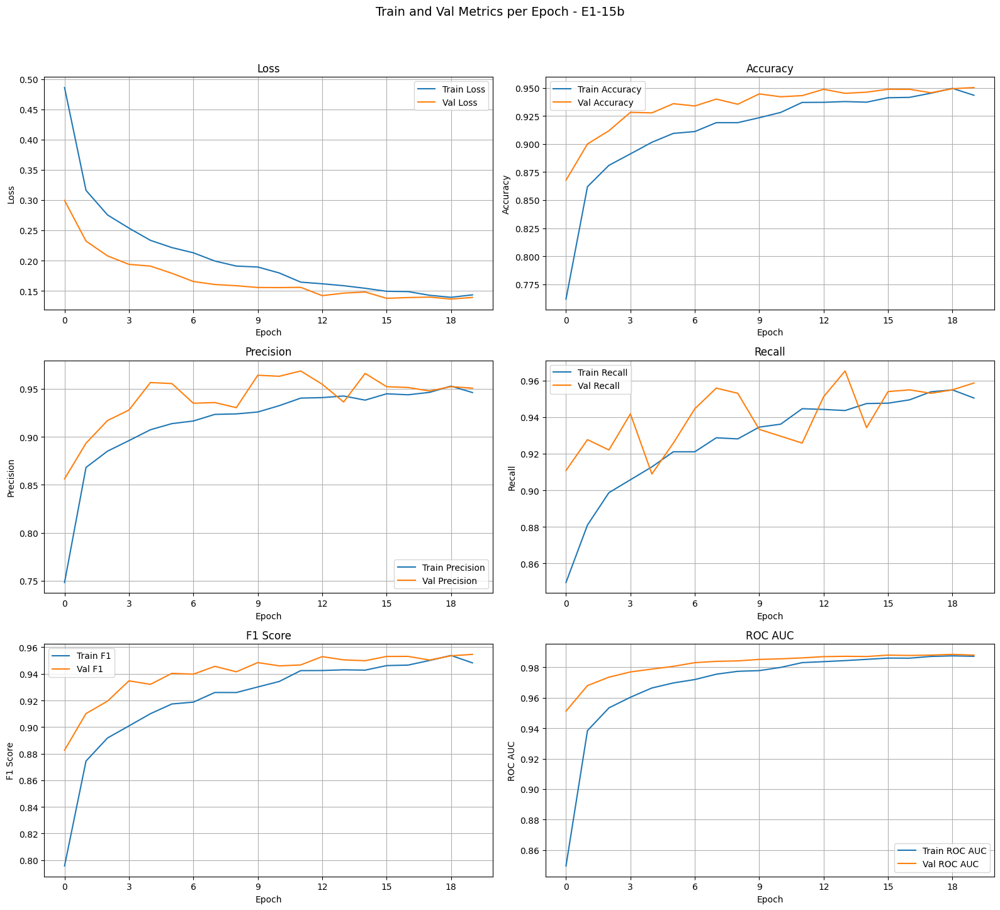

Notebook link: [Experiment E1-15b](https://github.com/mlpub/steel-defect-detection-s1/blob/main/notebooks/stage1-binary-classification-e1-15b.ipynb)


#### Finding Best Threshold

After selecting E1-15b as the final MobileNet V2 model, the next step is to determine the optimal classification threshold. Instead of using the default threshold of 0.5, thresholds are systematically scanned from 0.00 to 1.00 in increments of 0.01 to identify the value that maximizes model performance.

For each threshold, the F1 score is computed on the validation dataset, as it provides a balanced measure between precision and recall, which is critical for defect detection tasks.

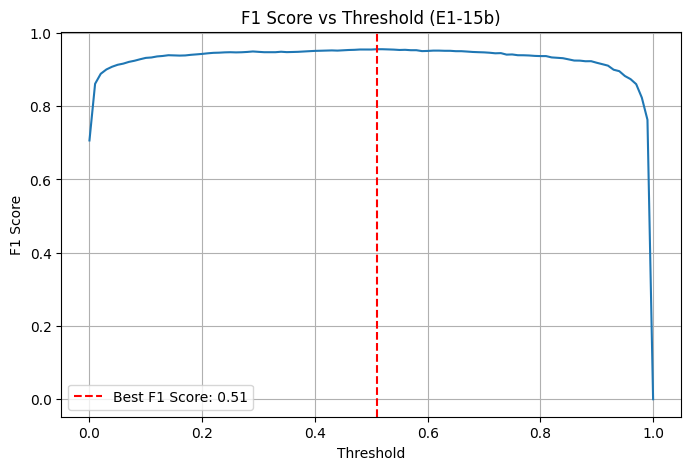

The results show that the maximum F1 score of 0.9555 is achieved at a threshold of 0.51. This threshold is therefore selected as the final decision threshold for the model.


#### Training Final Model with Training+Validation Dataset

For the final model, E1-15b is retrained using the combined training and validation datasets to maximize the amount of data available for learning. This approach aims to further improve generalization before performing a final evaluation on the held-out test dataset, which remains completely unseen during training and model selection.

After retraining, the model is evaluated on the test set using the previously selected optimal classification threshold.

Test Set Performance:
- **Test Loss:** 0.1308
- **Test Accuracy:** 0.9533
- **Test Precision:** 0.9638
- **Test Recall:** 0.9502
- **Test F1 Score:** 0.9569
- **Test ROC AUC:** 0.9900

**Confusion Matrix (Test):**

|        | Predicted Non-Defect | Predicted Defect |
|--------|----------------------|------------------|
| Actual Non-Defect | TN = 848             | FP = 38          |
| Actual Defect     | FN = 53              | TP = 1011        |

These results demonstrate strong generalization and high defect detection capability of the final MobileNet V2 model on unseen data. The high F1 score and ROC-AUC demonstrate a good balance between precision and recall, while the low number of false negatives confirms the model’s effectiveness in detecting surface defects.

Notebook link: [Experiment E1-15c](https://github.com/mlpub/steel-defect-detection-s1/blob/main/notebooks/stage1-binary-classification-e1-15c.ipynb)


## 6. Exporting Notebook to Script

After all experiments and model evaluation in the notebook, the next step is to convert the notebook into a Python script.
This script will make it easier to retrain the model.

The src/train.py includes all steps to train the final model using the best parameters found before. Also export to onnx.

Process flow:
Here is a step-by-step documentation of the training process in the provided script:

1. Import Libraries
    Import essential libraries and custom modules.
2. Set Experiment Parameters
    Define experiment code and paths for saving model weights and ONNX files.
    Override some config parameters for final training (image size, epochs, learning rate).
3. Set Device and Seed
    Select device (cuda if available, else cpu).
    Set random seed for reproducibility using common_utils.set_seed().
4. Load and Split Data
    Load training data from CSV.
    Split data into train, validation, and test sets (70/15/15 split) using data_utils.split_data().
    Combine train and validation sets for final training.
5. Define Data Transforms
    Create data augmentation and normalization transforms for training and testing/validation.
6. Create Datasets and DataLoaders
    Instantiate custom dataset objects for training and testing.
    Create PyTorch DataLoaders for efficient batch processing.
7. Define Model Architecture
    Implement SteelModel class based on MobileNetV2.
    Freeze most base model layers except the last few.
    Add global average pooling, flattening, and fully connected layers.
8. Initialize Model, Loss, and Optimizer
    Move model to selected device.
    Set loss function (BCEWithLogitsLoss) and optimizer (Adam).
9. Training Loop
    Train the model for the specified number of epochs using train_utils.train_one_epoch().
10. Save Model Weights
    Save trained model weights to disk.
11. Export Model to ONNX
    Export the trained model to ONNX format using a dummy input tensor.

### Run the Script
Run train.py to generate model:
```
cd src
uv run train.py
```

After it runs, you will get a file named in the current folder:
* stage1-E1-FINAL-model.pth
* stage1-E1-FINAL-model.onnx


Python script:
* [train.py](https://github.com/mlpub/steel-defect-detection-s1/blob/main/src/train.py)
* [predict.py](https://github.com/mlpub/steel-defect-detection-s1/blob/main/src/predict.py)


## 7. Deployment API and Dockerization

### 7.1. FastAPI

The file src/predict.py runs a FastAPI application that exposes a POST endpoint at /predict on port 9696.
Both request and response schemas are defined using Pydantic BaseModel to ensure strict data validation.

Input format (JSON):
```
{
    "image":"image in base64 format"
}
```
The image must be encoded in Base64 format before being sent to the API.

**Run FastAPI**
```
cd src
uv run predict.py
```
Expected output:
```
INFO:     Started server process [228540]
INFO:     Waiting for application startup.
INFO:     Application startup complete.
INFO:     Uvicorn running on http://0.0.0.0:9696 (Press CTRL+C to quit)
```

**Test Prediction**
Open a new terminal and run client.py with an image path as input:
```
cd src
uv run client.py ../data/train_images/0a4ad45a5.jpg
```
Expected response:
```
Response:  {'defect_prob': 0.9914940595626831, 'defect_status': 1}
```


### 7.2. Docker
This project includes a Dockerfile (dockerfile) for containerized deployment.


#### Build Docker Image
```
docker build -t steel-defect-app .
```

#### Run Docker Container:
```
docker run -d -p 9696:9696 steel-defect-app 
```
`-p 9696:9696` : the FastApi run at port 9696 inside the container and it exposed to port 9696 on the host.

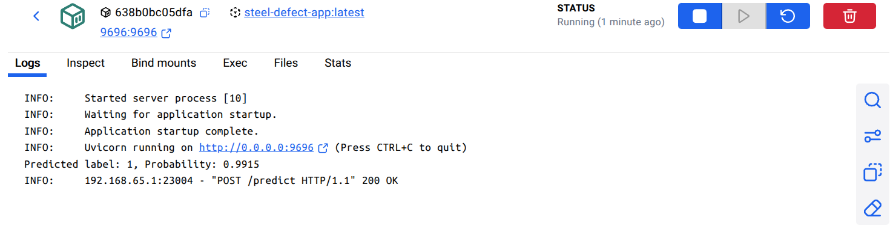

The API can now be accessed from the host at: `http://localhost:9696/predict`

**Test Docker Container**
```
cd src
uv run client.py ../data/train_images/0a4ad45a5.jpg
```
Expected response:
```
Response:  {'defect_prob': 0.9707304835319519, 'defect_status': 1}
```


### 7.3. AWS Serverless
This project also includes a Serverless Dockerfile (dockerfile-serverless) designed for AWS Lambda–style deployment.

#### Build Serverless Docker Image
```
docker build -f dockerfile-serverless -t steel-defect-serverless-app .
```

#### Run Serverless Container
```
docker run -d -p 9696:8080 steel-defect-serverless-app 
```
`-p 9696:8080` : the serverless run at port 8080 inside the container and it exposed to port 9696 on the host.

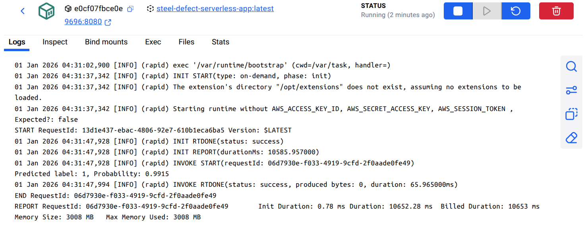

The API endpoint is accessible at: `http://localhost:9696/2015-03-31/functions/function/invocations`

**Test Serverless Container**
```
cd src
uv run client-serverless.py ../data/train_images/0a4ad45a5.jpg
```
Expected response:
```
Response:  {'statusCode': 200, 'body': '{"defect_prob": 0.9707304835319519, "defect_status": 1}'}
```

Python script:
* [lambda_function.py](https://github.com/mlpub/steel-defect-detection-s1/blob/main/src/lambda_function.py)
* [client.py](https://github.com/mlpub/steel-defect-detection-s1/blob/main/src/client.py)
* [client-serverless].py](https://github.com/mlpub/steel-defect-detection-s1/blob/main/src/client-serverless.py)

Docker file:
* [dockerfile](https://github.com/mlpub/steel-defect-detection-s1/blob/main/dockerfile)
* [-serverless](https://github.com/mlpub/steel-defect-detection-s1/blob/main/dockerfile-serverless)


## 8. Deploy on Google Cloud (Cloud Run)

Google Cloud Run is serverless like Lambda, but architecturally it is container-based.
Note: This project was deployed using Google Cloud SDK version **550.0.0**. Future versions may have slight differences in CLI behavior.


### 8.1. Install gcloud on Ubuntu
1. Download package
```
curl -O https://dl.google.com/dl/cloudsdk/channels/rapid/downloads/google-cloud-cli-linux-x86_64.tar.gz
```
2. Extract
```
tar -xf google-cloud-cli-linux-x86_64.tar.gz
```
3. Install
```
./google-cloud-sdk/install.sh
```
4. Verify gcloud installation:
```
gcloud --version
```
Output:
```
Google Cloud SDK 550.0.0
bq 2.1.26
bundled-python3-unix 3.13.10
core 2025.12.12
gcloud-crc32c 1.0.0
gsutil 5.35
```

### 8.2. Install gcloud on Windows
1. Download installer `https://dl.google.com/dl/cloudsdk/channels/rapid/GoogleCloudSDKInstaller.exe`
2. Run installer.
3. Verify gcloud installation:
```
gcloud --version
```
Output:
```
Google Cloud SDK 550.0.0
bq 2.1.26
core 2025.12.12
gcloud-crc32c 1.0.0
gsutil 5.35
```


### 8.3. Initialize and authorize the gcloud CLI
To initialize gcloud cli, make sure you are already registered with Google Cloud.

```
gcloud init
```
```
Welcome! This command will take you through the configuration of gcloud.

Your current configuration has been set to: [default]

You can skip diagnostics next time by using the following flag:
  gcloud init --skip-diagnostics

Network diagnostic detects and fixes local network connection issues.
Checking network connection...done.                                            
Reachability Check passed.
Network diagnostic passed (1/1 checks passed).

You must sign in to continue. Would you like to sign in (Y/n)?  y

Pick cloud project to use: 
 [1] cracked-quark-582011-a1
 [2] gen-lang-client-0007622115
 [3] Enter a project ID
 [4] Create a new project
Please enter numeric choice or text value (must exactly match list item):  1

Your current project has been set to: [cracked-quark-582011-a1].

```

* Verify gcloud is set correctly
```
gcloud config list
```

* Enable required services (ONE TIME)
```
gcloud services enable \
  run.googleapis.com \
  artifactregistry.googleapis.com \
  cloudbuild.googleapis.com

```


### 8.4. Deploy to Cloud Run
To reduce container size and cold-start latency, the trained model is exported to ONNX format.
This avoids installing the PyTorch runtime and significantly reduces container size, resulting in faster startup times on Cloud Run.

Cloud Run automatically scales services to zero during periods of inactivity.
As a result, when a new request arrives after an idle period, the service may experience higher latency due to a **cold start**, where a new container instance must be created and initialized.

In folder `gcp`, it contains files:
- app.py
  FastAPI application exposing the `/predict` endpoint.
- requirements.txt
  Python dependencies required by `app.py`.
- stage1-E1-FINAL-model.onnx
  Exported ONNX model used for inference.
  Make sure the ONNX file is in this folder.


To deploy the service, run:
```
cd gcp
gcloud run deploy steel-defect-app --source .  --region asia-southeast1  --allow-unauthenticated --set-env-vars GUNICORN_CMD_ARGS="--worker-class uvicorn.workers.UvicornWorker"
```

Or run bat/sh script:
* Windows
    ```
    cd gcp
    deploy-cloud-run.bat
    ```
* Linux
    ```
    cd gcp
    ./deploy-cloud-run.sh
    ```


Note: 
- The `.gcloudignore` file contains a list of files and directories that will be excluded from being uploaded to Cloud Run.
- `run` : Refers to Google Cloud Run.
- `--source .` : Uploads all files in the current directory to Cloud Run. Cloud Build will automatically build the container image.
- `--region asia-southeast1` : Specifies the deployment region.
- `--allow-unauthenticated` : Makes the service publicly accessible. For production environments, it is recommended to restrict access
- `--set-env-vars GUNICORN_CMD_ARGS="--worker-class uvicorn.workers.UvicornWorker"` : Required when deploying FastAPI with Gunicorn, ensuring the application runs with the uvicorn ASGI worker.


When deployment succeeds, the following output is shown:
```
Service [steel-defect-app] revision [steel-defect-app-00003-pvv] has been deployed and is serving 100 percent of traffic.
Service URL: https://steel-defect-app-901723644506.asia-southeast1.run.app
```
The service endpoint is `https://steel-defect-app-901723644506.asia-southeast1.run.app`

The deployed service can be verified in the Cloud Run console:
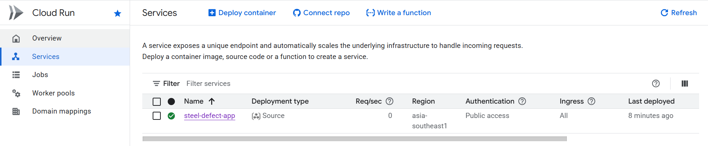


To test the deployed API, run:
```
cd src
uv run client-gcp.py ../data/train_images/00f6e702c.jpg
```
Response:
```
Status code: 200
Raw response: {"defect_prob":0.9856130480766296,"defect_status":1}
```

Cloud Run logs can be viewed in the Logs Explorer:
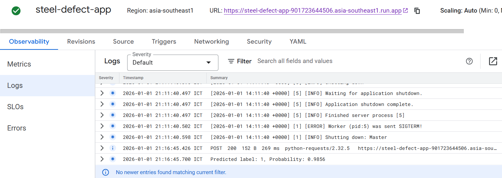

These logs can be used to monitor request latency, errors, and model inference behavior.


Python script:
* [app.py](https://github.com/mlpub/steel-defect-detection-s1/blob/main/src/gcp/app.py)
* [client-gcp.py](https://github.com/mlpub/steel-defect-detection-s1/blob/main/src/client-gcp.py)


## 9. Web UI with Streamlit
In this section, instead of calling the API directly, a simple Streamlit web application is provided.
The Streamlit app acts as a lightweight frontend that communicates with the Cloud Run inference API.
The app allows users to upload an image through a web interface, sends the image to the deployed Cloud Run service, and displays the prediction result.

### Running the Streamlit App
The Streamlit dependency is already included in pyproject.toml.
Run the app locally with:
```
uv run streamlit run streamlit-app.py
```

The application will be available at:
```
http://localhost:8501
```


Python script:
* [streamlit-app.py](https://github.com/mlpub/steel-defect-detection-s1/blob/main/src/streamlit-app.py)


## 10. Future Work
Several improvements and extensions are planned to further enhance this project:

1. Improve Stage 1 Binary Classification Performance
   * Experiment with more advanced model architectures and fine-tuning strategies.
   * Explore tile-based training and inference by dividing high-resolution steel images into overlapping patches, reducing aspect ratio distortion and improving sensitivity to small defects.

2. Stage 2: Defect Type Classification and Segmentation
   * Develop a multi-class classification model to identify specific defect categories.
   * Implement pixel-level defect segmentation to accurately localize defect regions on steel surfaces.
   * Evaluate segmentation performance using metric Intersection over Union (IoU).

3. Integrate Stage 1 and Stage 2 into a Unified Pipeline
   * Combine the binary classification and defect segmentation stages into a single end-to-end inference pipeline.

4. Explore Cloud Run in More Detail


Overall, this future work aims to evolve the project from a proof-of-concept into a more complete and production-ready steel surface defect detection system.


